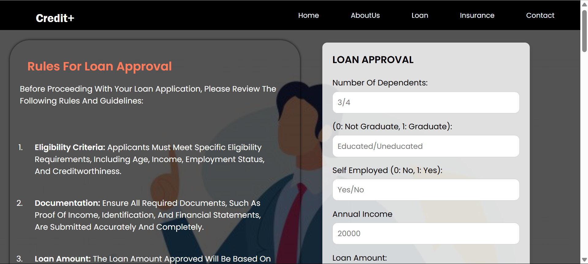
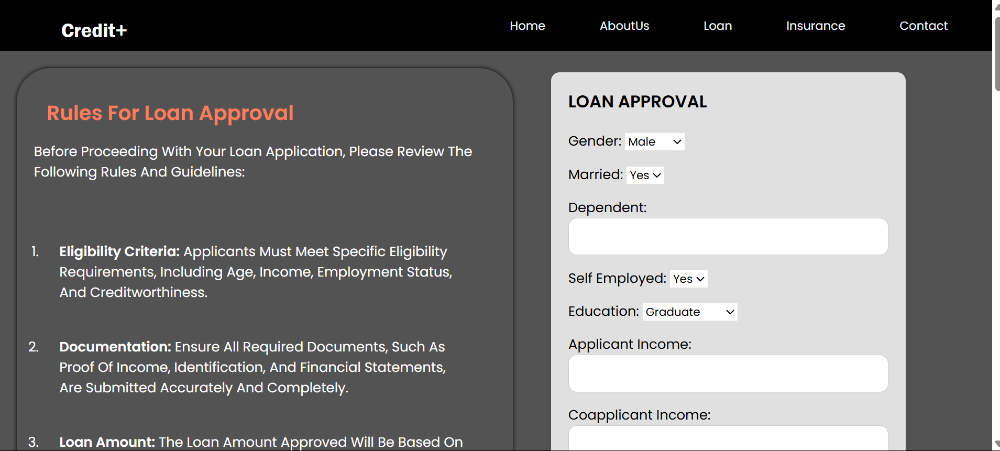
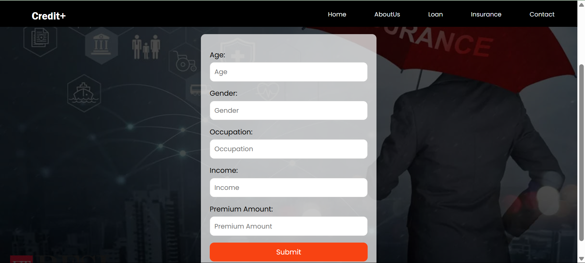

# Credit+

**Credit+** is an intelligent platform that predicts loan approvals (Home, Personal, General) and recommends insurance policies using AI.

## 🚀 Features

- 🏠 **Home Loan Approval Prediction**
- 👤 **Personal Loan Eligibility Check**
- 🏦 **General Loan Prediction**
- 🛡️ **Insurance Recommendation System**
- 💻 **User-friendly Web Interface**
- ✉️ **Contact Form for Feedback**

## 🛠 Tech Stack

- **Backend**: Python (Flask)
- **Frontend**: HTML, CSS
- **ML**: Scikit-learn
- **Tools**: VS Code, Git & GitHub

## 📷 Screenshots

